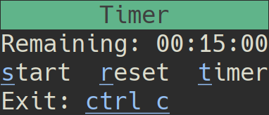
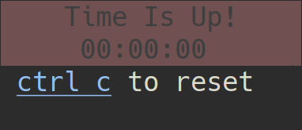

# Termy

A little Ruby timer that sits in your terminal and eats away seconds.  Its
banner will shift from green, to yellow, to red as the timer wears down.  It'll
continously flash red/yellow once the timer is up.

## Usage

You can run an instance of Termy by calling `termy` from a console after
installation. Once it's up you can:

* Start the timer by pressing `s`, `space`, or `return`.
* Stop the timer by pressing `ctrl-c`
* Reset the timer by pressing `r`
* Set a new time limit by pressing `t`
* Exit Termy by pressing `ctrl-c` from its main window.

*Note that when the timer is running termy will only respond to a stop command,
at which point it can resume where it left off by using another start command.*

## Behavior

Termy's banner will change from green to yellow once a third of the time 
remains.
It will change to red once only a tenth of the time remains.
After time expires termy will flash yellow/red repeatedly until reset.

*Note that your exact color scheme within your own console will inevitably change 
the shades you see here*

## Installation

The most straight forward thing to do would be to clone/download the repo, 
navigate to *pkg* and install the current termy version (currently 0.1.0).

`gem install termy-0.1.0.gem`

You may need to run `bundle install` within termy's main directory if you 
have issues with dependencies, etc.

*I haven't test this on Mac or Windows but I see no reason it shouldn't work
out of the box.*

## Why Tho?
I'm doing a lot of pair programming in a/A and I can't be bothered to look at the 
weblink timer that was provided.  This way I can spawn and shrink a small terminal
instance off to the side that better draws my attention at the right time.

## ToDo

* Write and compile complete documentation (though it's not really needed...)
* Perhaps allow for a customized messsage to be displayed on timer expiration?
* Ditto above but perhaps play a sound?
* Figure out why not all consoles display the super cute spinning clock unicode
    I tried to implement.
* Add box surround or maybe other animation goodies.
* Add some rspec tests.
* feelin cute, might delete later idk

## Contributing

Bug reports and pull requests are welcome on GitHub at https://github.com/stkterry/termy. 
This project is intended to be a safe, welcoming space for collaboration, and 
contributors are expected to adhere to the 
[Contributor Covenant](http://contributor-covenant.org) code of conduct.

## License

The gem is available as open source under the terms of the 
[MIT License](https://opensource.org/licenses/MIT).

## Code of Conduct

Everyone interacting in the Termy project’s codebases, issue trackers, chat 
rooms and mailing lists is expected to follow the
[code of conduct](https://github.com/stkterry/termy/blob/master/CODE_OF_CONDUCT.md).
